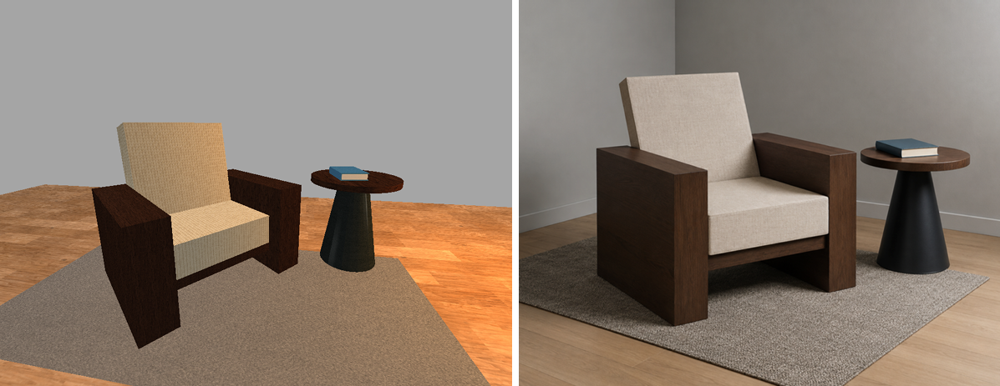
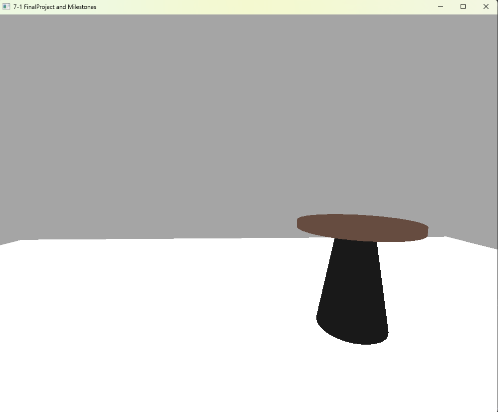
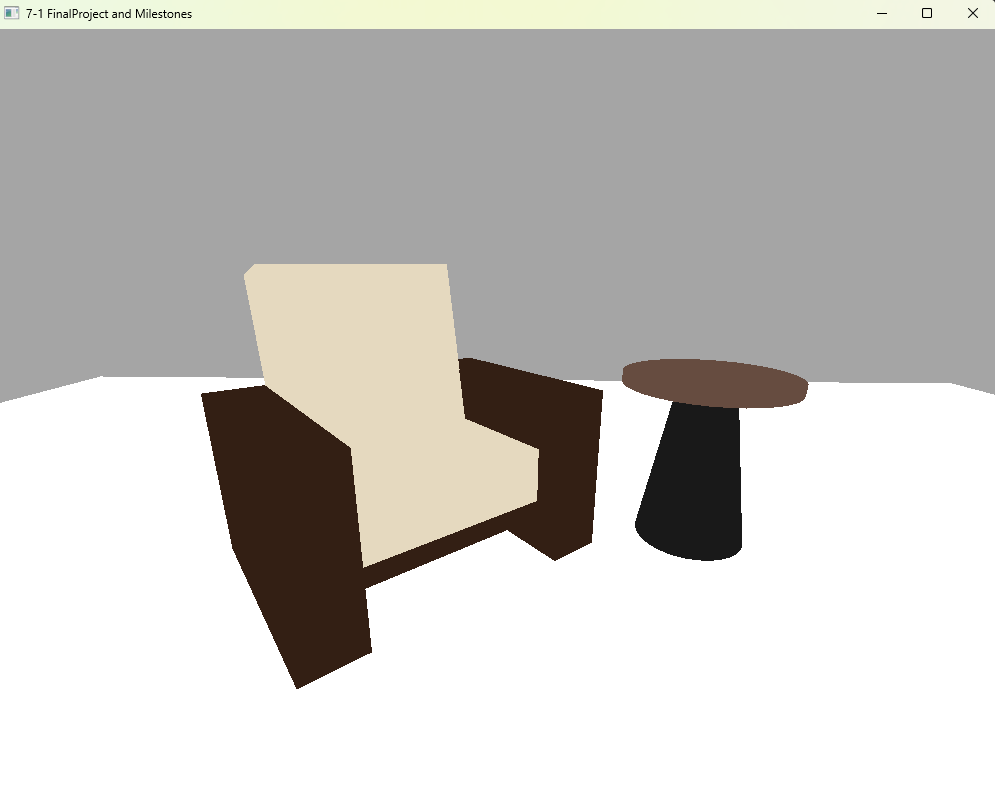
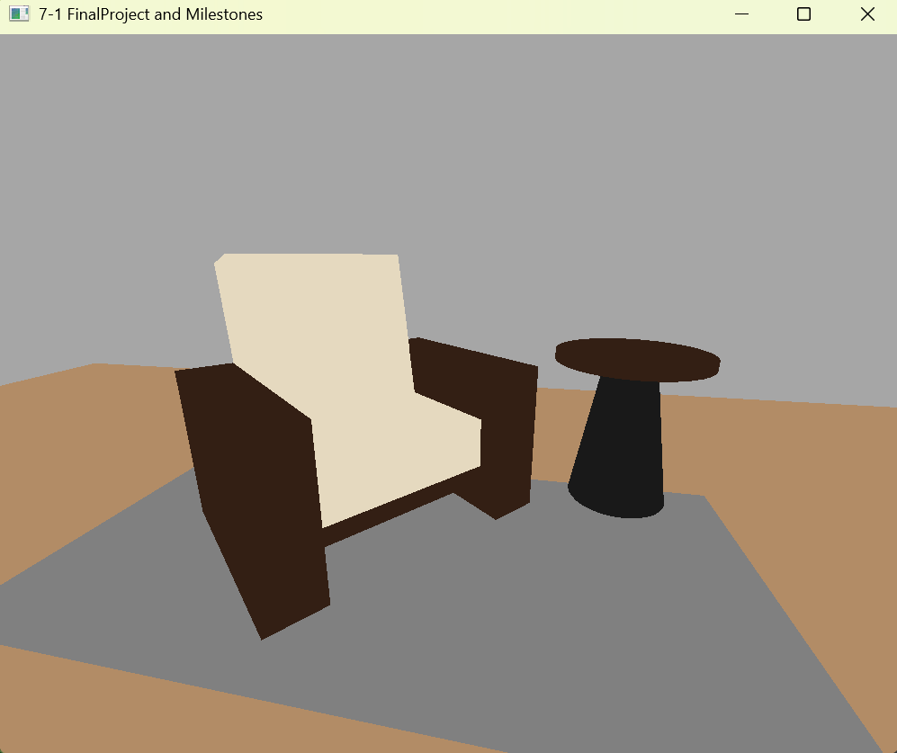
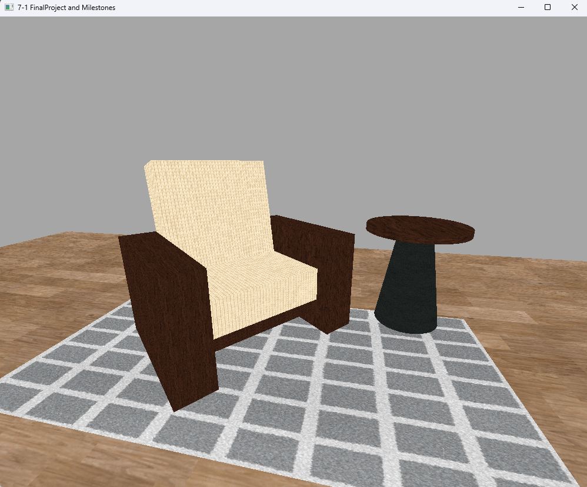
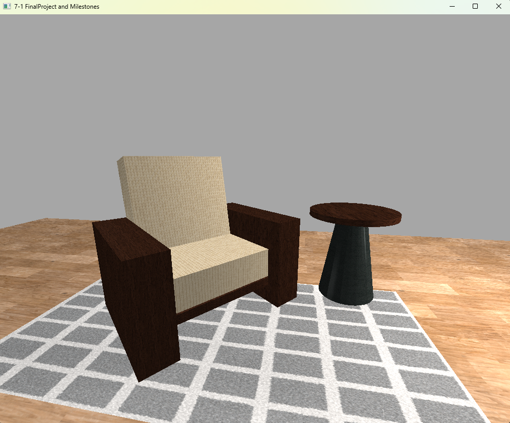
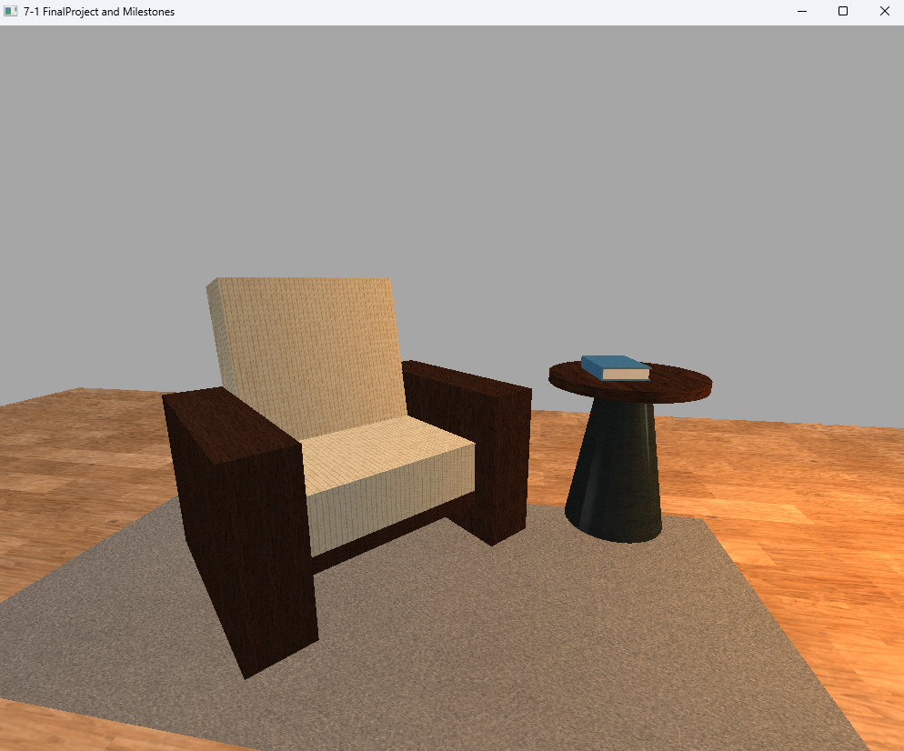

# CS 330 3D Scene Replication: Modern Armchair

## Overview
This project is a 3D replication of a 2D image, built using C++ and OpenGL. The scene features a modern-styled wooden armchair with a beige fabric-covered cushion, a wooden floor, a grey rug, and a small side table made from a matte black metal base and wooden top, with a blue-covered book resting on it. 

Below is a comparison of the final render and the reference photo:

## Development and Design Process
When I approached this project, I wanted to find a good balance between choosing something fun and highly achievable. I was inspired by a final project example which showcased a throne room, and since I often joke that an armchair is the modern throne, this scene felt perfect. 

My approach to developing this scene was highly iterative. I started simple and progressively added complexity to refine the application:
* **Modeling:** I started by building the table, as it was the easiest object to create. Once I gained more confidence, I tackled the most complex object in my scene: the armchair. I built the armchair assuming a 40-degree rotation so it would face a similar direction as in the chosen image.
* **Texturing:** I downloaded royalty-free textures from ambientCG. I adjusted the UVScale to apply tiling according to the XYZ scale for the mesh to make sure the textures wouldn't stretch. However, in some places (like the floor), a bit of stretching looked more in line with the reference image. I also edited a checkered texture to be grey for the rug, and color-edited another texture to get the perfect beige for the cushion.
* **Lighting:** I initially used a directional light to make sure the scene wasn't completely dark. I noticed that the light in the original image mostly came from the right-front side, so I added a point light there, and a weaker fill light on the other side to keep the scene balanced. To finish the polish, I changed the main light to a cozy orange.

### Iteration Progress
Here is a look at the gradual improvement of the scene throughout the development process:

*Step 1: Building the side table as the initial object.*

*Step 2: Modeling the complex armchair with a 40-degree rotation.*

*Step 3: Applying base colors to match the reference and adding the initial rug object.*

*Step 4: Sourcing royalty-free textures from ambientCG and scaling them to prevent stretching.*

*Step 5: Setting up the directional, point, and fill lights to capture the scene's depth.*

*Step 6: Adding the final book prop, shifting the light to a cozy orange, and color-editing the rug texture to grey.*

This iterative process helped me evolve my development strategies. Starting with primitive shapes and gradually refining textures, lighting, and camera placement taught me how to break down complex visual requirements into manageable, step-by-step coding tasks.

## Navigation and Controls
The user can fully explore the 3D environment using a combination of keyboard and mouse inputs:
* **WASD Keys:** Control directional movement (forward, backward, left, right).
* **E & Q Keys:** Pan the camera up and down.
* **O & P Keys:** Toggle between orthographic and perspective projections. Pressing 'O' snaps the camera in front of the scene parallel to the floor, while 'P' snaps it back to the starting position.
* **Mouse Scroll Wheel:** Controls the movement speed of the camera.

## Code Architecture and Modularity
To ensure my code remained modular and organized as the project grew, I refactored my earlier submissions. I created a reusable helper function named `RenderShape` that accepts parameters for scale, position, rotation, texture tag, texture scale, material, and shape type. Utilizing this reusable helper method increased the level of abstraction, significantly reduced the number of lines of code, and made the project much easier to read.

I also utilized custom functions for specific interactive elements. For example, the `Mouse_Scroll_MovementSpeed_Callback` function increments and decrements the camera speed, using basic `if` statements to enforce boundaries so the speed cannot drop below 1 or exceed 50.

## Future Application
Working on this project expanded my understanding of computational graphics and the underlying math required to manipulate 3D space. The skills crafted here are directly applicable to my future software engineering goals. Whether designing interactive user interfaces, coding elements for video games, creating data visualizations, or exploring real-time rendering, the ability to effectively render and navigate 3D environments provides a strong, practical foundation for tackling performance-critical graphical applications in my professional pathway.