# CS 340 README Template

## About the Project/Project Title
The project is a CRUD (Create, Read, Update, Delete) Python module designed to work with a MongoDB database. Its main purpose is to act as a “middleman”, allowing a Python application to interact with a MongoDB database with improved simplicity. 
This project also includes a full-stack web dashboard for Grazioso Salvare. It uses clickable radio buttons that act as filters to show shelter animals by rescue training type, as well as the ability to sort by ascending or descending order for each field. The results are shown in a data table, a pie chart, and a map that shows the shelter location of the selected animal.

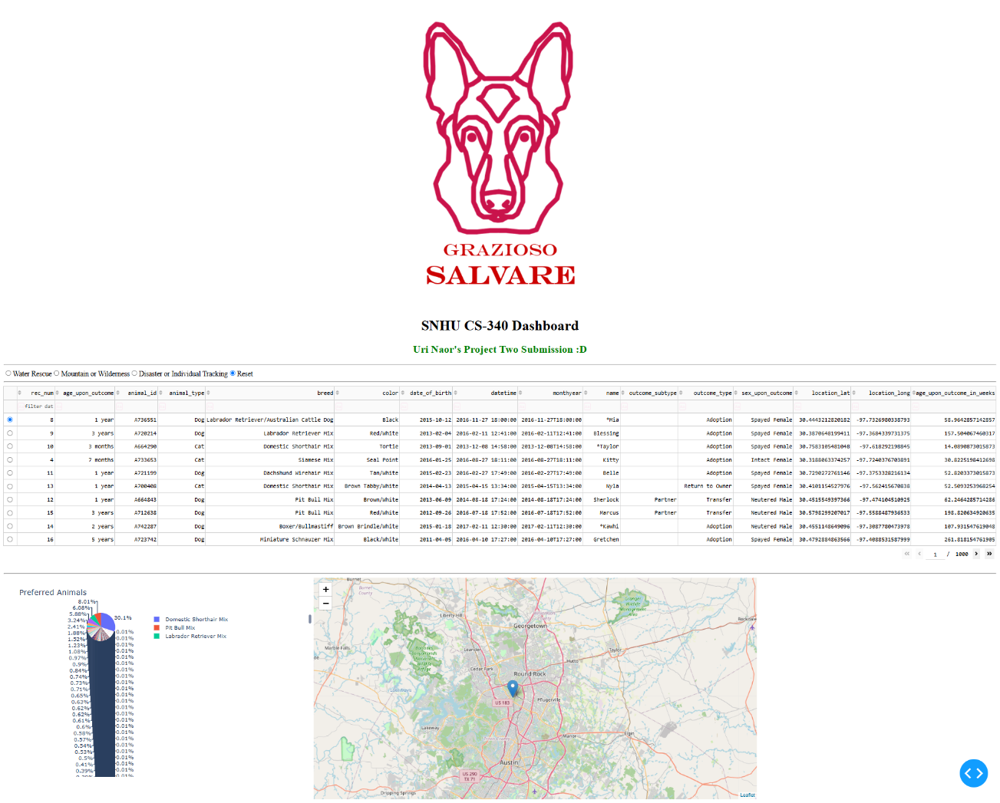
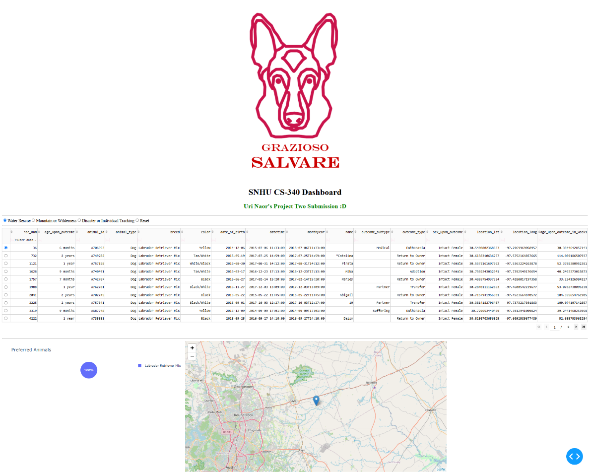
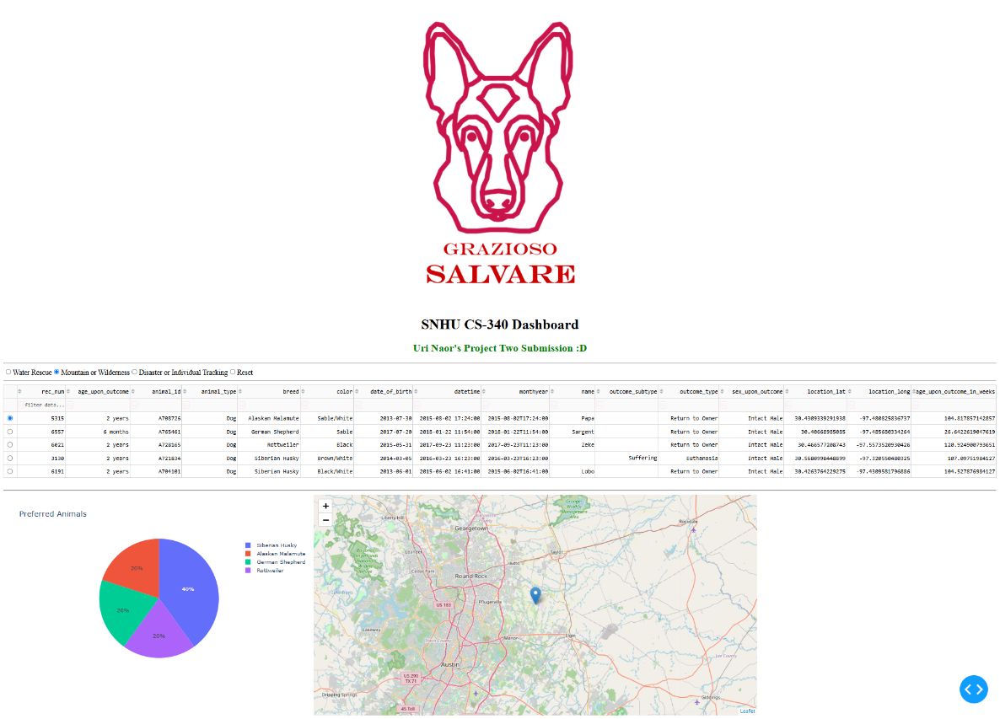
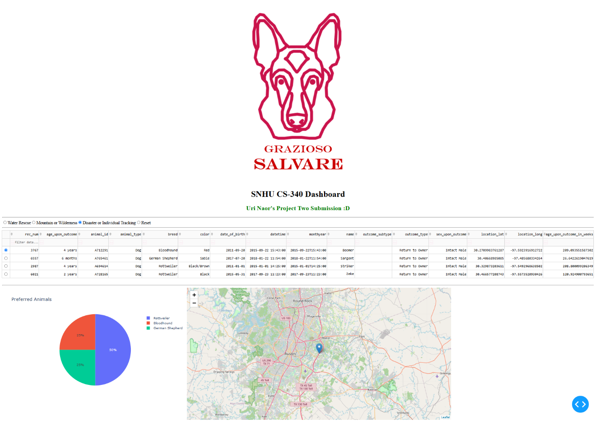

## Motivation
The motivation behind this project is to build a reliable and reusable component to make writing DB queries simpler and cleaner. By wrapping the raw PyMongo operations inside a Python class that handles errors and bad data safely, the goal of this project is to follow the DRY (Don’t Repeat Yourself) principle and make the development experience smoother and more pleasant. This lets developers focus on development rather than re-writing the same boilerplate code over and over again.

## Getting Started
Before we can start using this module, we need to ensure that our database and user authentication are set up properly. To do this I imported a dataset to be used with the command: `mongoimport –db aac –collection animals –type csv –headerline –file aac_shelter_outcomes.csv`. 

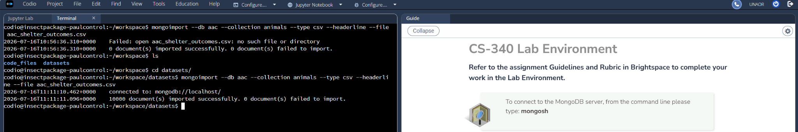

After importing the dataset, I created a user with read and write privileges for the aac DB and added it to the admin database.

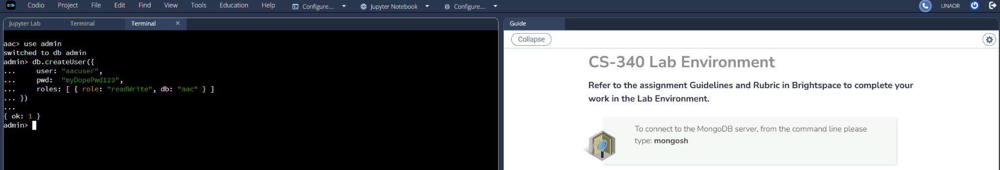

After the initial set up, I went ahead and wrote the Python module. This module implements five things:
* By default, if the constructor doesn’t get any arguments, it automatically defaults to the user and database that were defined in the previous step. (If we want to make this module more general a good idea would be to remove this functionality, but since I’m focusing on that specific database and user, then it’s a convenient feature in this case.)
* A create operation which uses the MongoDB insert_one method. I made sure to return True if it works, or False if there’s any issue with the insertion.
* A read operation which uses the MongoDB find method. I made sure to convert the cursor that’s returned into a list before returning it upon success, and I return an empty list if there’s any issue with reading.
* An update operation which uses the MongoDB update_many method. I return the number of modified objects upon success or 0 in case of a failure (since no objects are modified in that case).
* A delete operation which uses the MongoDB delete_many method. I return the number of deleted objects upon success or 0 in case of a failure.

A few challenges I faced were first remembering how to pass arguments by default in python. I also wasn’t sure if list() is able to convert a MongoDB cursor. I overcame these challenges with a few Google searches and some reading.

## Tools Used
The following tools and libraries were used to build and test this project:
* MongoDB: Chosen as the backend database due to its schema-less design and the fact that Python dictionaries map directly to MongoDB entries, making CRUD operations smooth, easy and seamless.
* Python: The core programming language used to build the simplified CRUD operations.
* PyMongo: The official Python driver for MongoDB, used for mapping Python dictionaries directly to MongoDB documents.
* Jupyter Notebook: Used as the testing environment as it allows to execute code cells individually and instantly verify the database outputs.
* Dash: An open-source Python framework used to build web applications and dashboards. Chosen due to the fact that it’s built specifically for data apps, making it straightforward to link MongoDB results and visualizations to a clean UI using just Python.

## Usage
We can use our Python module to simplify CRUD operations over a MongoDB database. To view this here is an example where I create a new animal record, and add it into the aac database, and then verify that it has been added by reading using the module as well.

### Importing and initializing a new object
To import the module, we would simply write `from CRUD_Python_Module import AnimalShelter`.
To initialize a new object we could either pass arguments or use the default values like so:
`AnimalShelter(USER, PASS, HOST, PORT, DB, COL)`
The default values are: `USER='aacuser', PASS='myDopePwd123', HOST='localhost', PORT=27017, DB='aac', COL='animals'`

Screenshot example:
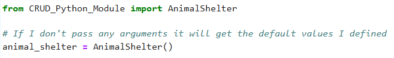

### Creating a record to add to the DB
For an object to be compatible with our module it must be defined as a dictionary like so:
`{ key : value }`

Screenshot example:
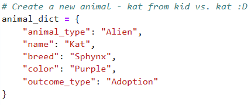

### Using the Create operation
To use the create function we simply pass the created dict formatted record:
`object.create(record_dict)`

Screenshot example:
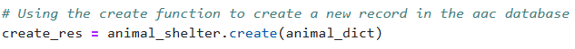

### Using the Read operation
To use the read function we pass a MongoDB query formatted as a dictionary:
`object.read(query_dict)`

Screenshot example:
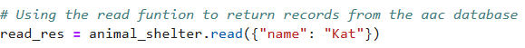

### Using the Update operation
To use the update function we pass a MongoDB query formatted as a dictionary and a second dictionary using MongoDB operators (like $set), to apply the changes:
`object.update(query_dict, { operator: updated_record_dict })`

Screenshot example:
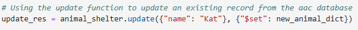

### Using the Delete operation
To use the delete function we pass a MongoDB query formatted as a dictionary:
`object.delete(query_dict)`

Screenshot example:
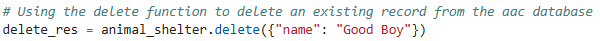

## Testing
To run tests to verify the results we can simply save the results of the function calls and check if they match the expected output of a successful operation.
* create - returns true upon success and false otherwise.
* read - returns a populated list upon success and an empty list otherwise.
* update – returns the number of modified objects. If failed, it will return 0.
* delete – returns the number of deleted objects. Also returns 0 in the case of a failure.

Screenshot example:
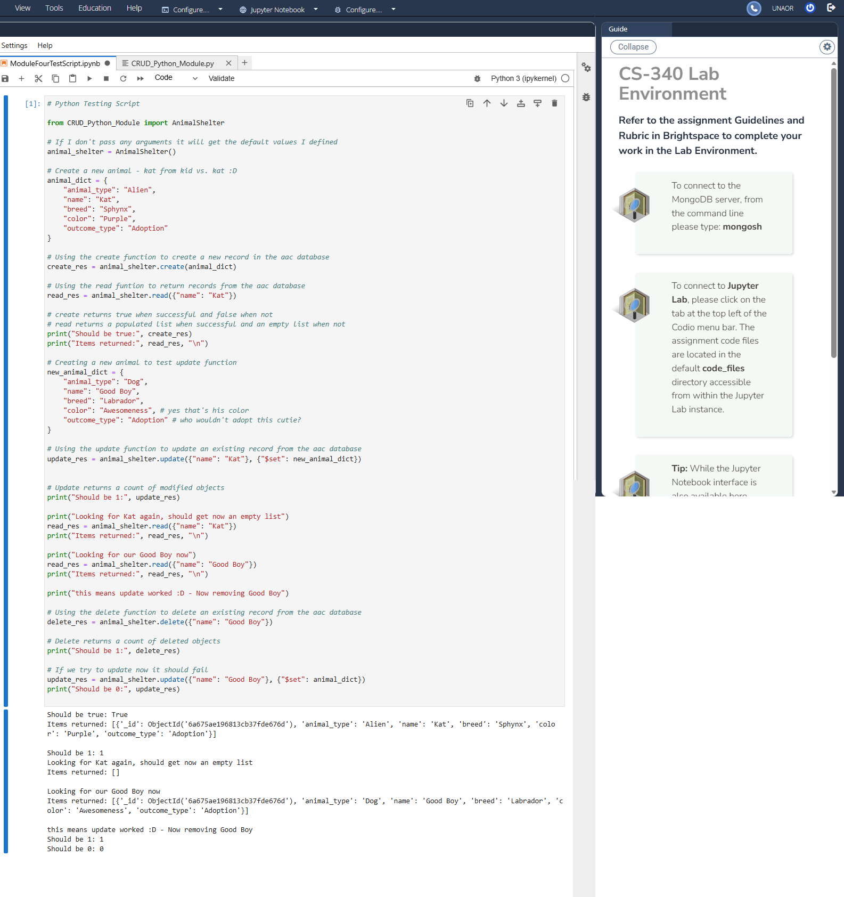

## Steps Taken
I imported the dataset into MongoDB and created a user in the admin db (with the permissions to read and write in the aac db) so I could later access this dataset securely from the app. I then built a CRUD Python Module to handle database operations. After the Python Module was complete, it made writing the web app much easier. I started work on the web app – I connected the backend by importing my CRUD module and authenticated with the credentials of the user I made earlier. I updated the layout to include the branding logo and my unique identifier, and added the radio buttons for each of the rescue types, and configured the data table to support sorting, filtering and pagination. Lastly, I implemented callback functions to handle user inputs, such as updating what the dashboard shows based on the selected radio button and the requirements from the provided PDF, as well as updating the pie chart and location to reflect the filtered data.

## Challenges Encountered
Since I’ve never worked with Dash, I had to juggle around a lot of reading to finish this project. Luckily the most needed resource was extremely convenient to use and read, which is the https://dash.plotly.com/ website. The documentation was organized extremely well and made reading and learning fun. While I did have some MongoDB and Python experience going into it, combining everything together definitely had me googling around quite a bit.

Overall, I’m happy with the result. The project was an interesting way to combine different technologies to create something I could genuinely see useful in a real-life scenario (Saving people and dogs at the same time! Can’t imagine a better cause than this one).

## Resources
* https://dash.plotly.com/
* https://www.mongodb.com/docs/
* https://pymongo.readthedocs.io/en/stable/

## Roadmap/Features
Optionally removing the default constructor arguments for the CRUD Python Module and renaming the class to something more general, so that the module would be more flexible and evergreen.

## Reflection

**How do you write programs that are maintainable, readable, and adaptable?**

Personally when I write code I try to break things up into different useable components,
both to ensure that I don't repeat myself and follow the DRY principle, as well as
it allows for a faster development process and it makes making changes a lot faster.

In this project a good example of this is the CRUD Python module. I've built it to be as reusable as possible.
Due to the requirements of this course I had to hardcode inside this module the aac user details
needed for the animal shelter project. Because I strive to have my code maintainable and reuseable though,
I added the comment above inside the "Roadmap/Features" section where I state that
it might be a good idea to make the module more generalized.

**How do you approach a problem as a computer scientist?**

As a computer scientist, I believe a great approach is to stop and break big and complicated problems
into smaller and more manageable ones. Every big and sometimes even scary problem, can be broken down
into small manageable pieces. This makes the path forward crystal clear. It changes the focus from
building the entire project into just finishing the next little piece and the next one and so on.
This approach is what helps me overcome complicated projects. When I first looked at the template code inside
Project Two it initially felt overwhelming, but I quickly focused on the next FIXME comment and the next one
focusing on learning the next little snippet, and that approach is what helped carry me throughout
many challenges while achieving good results.

**What do computer scientists do, and why does it matter?**

At the core, computer scientists take messy, real-world problems and turn them into structured, working solutions that people can actually rely on. In this project, that meant taking Grazioso Salvare's need to quickly identify rescue animals suited for search-and-rescue training and turning it into a dashboard that lets them filter, sort, and visualize their shelter data in quickly and easily instead of digging through spreadsheets by hand. Work like this matters because it directly saves people time and reduces the chance of human error when making decisions, in this case, helping match the right dogs to potentially life-saving training programs is a one of the best causes I can imagine. It both saves
the dogs from being shelter dogs and potentially euthanasia, as well as having the dogs train to save people's lives during emergencies. The best part about this project was that it felt realistic. I can genuinely see how this is a real problem that a business has, and how a computer scientist can help locate the data sets, build the dashboard and make
the entire operation a lot smoother, contributing to a great cause.

## Contact
Uri Naor