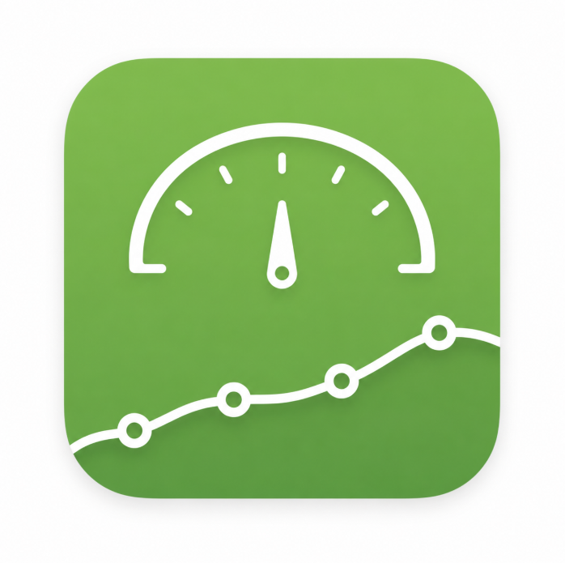
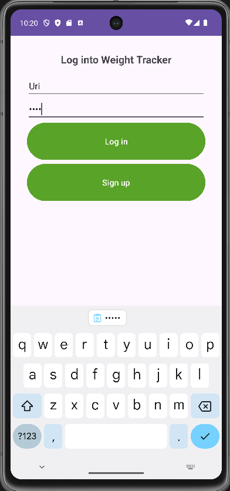
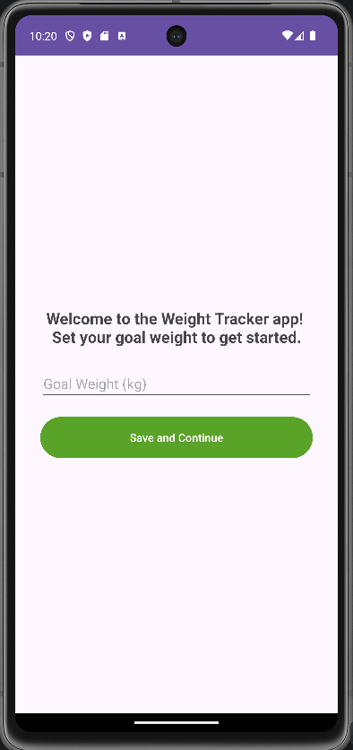
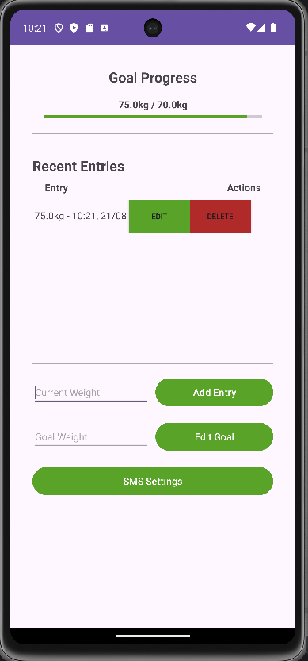
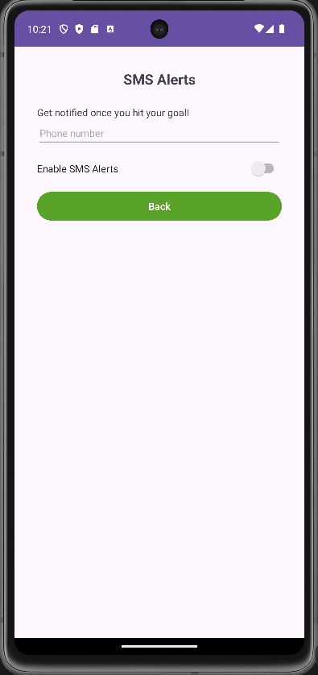

# Weight Tracker App

### App Overview & User Needs
This is a showcase of a Weight-Tracking app. The purpose of the app is to help its users hit their target weight, whether they’re trying to gain weight by gaining muscle or lose weight by losing fat. The app is meant to help them track their progress towards their desired weight. The main user need this app was designed to address is quick, frictionless tracking, as users are more likely to stick with the app if the tracking becomes a fun routine rather than a frustrating one.

### UI Design & User-Centered Features
The app wouldn’t need too many screens as I aim to make it as simple and frictionless as possible. It includes a screen for logging in/creating an account, a home screen with a grid that displays all the daily weights, and a minimalist screen to add a new entry. One of the pillars of the Android Design guide is “Don't overwhelm your user with too many actions per view”. This is the exact philosophy I went with, by making sure my app is minimalist and that every screen has only a couple of possible buttons or text fields. I also used a bright green color specifically to convey that this app is healthy and good for you. I believe overall this approach was successful because the end result was a simple and frictionless app that was intuitive to use.

Logo:

  

Screens:

  
  
  
  

### Coding Approach & Strategies
To make sure the UI connects with the backend well, the code acts as a bridge between the app's screens and the three database tables (user logins, daily weight, and goal weight). This makes the users data safely isolated and easily retrieved. Another strategy was ensuring the app only asks for the bare minimum permissions that it needs to operate properly. The only permission requested in the manifest is the `SEND_SMS` permission, which is only asked when the user tries to set the alert in the SMS Settings within the app. This approach to data isolation and the Principle of Least Privilege can easily be applied to future app development to make sure I focus my efforts on building a safe and minimal product which lets me focus on user needs.

### Testing
To ensure the code was functional, I heavily relied on the Android Studio emulator to play around with the features and manually simulate the complete user flow, from account creation all the way to data entry, editing the entries and deletion. I also tested various inputs and screen transitions to make sure everything felt seamless.

### Challenges & Innovation
A major challenge was making sure users actually stick to using the app. I focused on designing a flow that will encourage them to “habit stack” the usage of this app on top of an existing routine of checking their weight. The flow between screens feels natural: once they create their account they are immediately moved into a data entry screen where they’re prompted to enter their target weight, rather than being left on an empty dashboard. 

### Demonstrated Success
I believe that the component that was especially successful in showcasing my experience was the goal-set screen after signup. I believe this was a smart idea because it sets users up for success right away before they even see the dashboard or any empty data grids. It only appears one time upon initial signup, and I utilized the `finish()` method in Android to ensure they can't use the back button to return to it. Furthermore, I made sure that the design is minimalist and utilizes the brand's bright green color, which is pleasant to see and immediately reinforces the health-focused theme of the app.